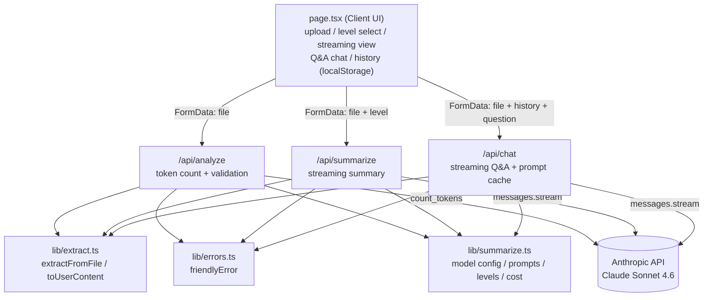

# Project Description

## 1. Project Overview

- **Project Name:** สรุปเล่ม (Sarup Lem) — AI Book Summarizer

- **Brief Description:**
  สรุปเล่ม is a web application that turns large documents — books, lecture notes, reports — into complete, structured Thai summaries. The user uploads a PDF, DOCX, TXT, or Markdown file; the system extracts its text (or, for scanned PDFs, passes the raw file to the model to read visually), counts the exact number of tokens, and displays an estimated cost in Thai Baht before anything is charged. Once the user confirms and picks a detail level, the app calls Claude Sonnet 4.6 and streams a chapter-by-chapter summary onto the page in real time.

  Beyond one-shot summarization, the app supports an interactive Q&A mode: after a summary finishes, the user can keep asking questions about the document in a chat box. The document is attached with a server-side prompt-cache marker, so every follow-up question after the first reads the document from cache at ~10% of the normal input price. Finished summaries are kept in a local history (browser `localStorage`) so they can be re-read at no cost, and can be exported as Markdown files.

- **Problem Statement:**
  Reading a full book or long report takes hours, and generic AI chat tools struggle with this job in practice: file-size limits force manual copy-pasting, summaries silently skip later chapters, and the user has no idea what a request will cost until after it is charged. This project addresses all three: it handles large files directly (up to ~1M tokens, roughly a 1,500-page book), uses a prompt structure that forces coverage of every section in original order, and shows the price up front so the user consciously approves every paid action.

- **Target Users:**
  - Students who need to digest textbooks and readings before exams
  - Office workers who must process long reports or documentation quickly
  - General readers who want a faithful overview of a book before committing to read it

- **Key Features:**
  - Upload PDF / DOCX / TXT / MD, including scanned (image-only) PDFs
  - Token counting + THB cost estimate **before** any paid API call
  - Three summary detail levels (Brief / Standard / Detailed) with live cost preview
  - Real-time streaming output rendered as Markdown on a paper-styled card
  - Document Q&A chat with prompt caching (~90% cheaper follow-up questions)
  - Local summary history (re-open past summaries for free, delete anytime)
  - Markdown export and copy-to-clipboard
  - Thai-language UI and human-friendly Thai error messages

- **Screenshots:**
  <!-- TODO: add screenshots, e.g. -->
  <!--  -->
  <!--  -->
  <!--  -->
  <!--  -->

- **Proposal:** <!-- TODO: add link, e.g. [Project Proposal (PDF)](docs/proposal.pdf) -->

- **Presentation:** <!-- TODO: add YouTube link -->

---

## 2. Concept

### 2.1 Background

The idea came from a simple, recurring situation: being handed a long document (a textbook chapter, a 300-page PDF, meeting documentation) with not enough time to read it properly. Existing AI chat tools can summarize text, but using them for whole books is clumsy — files must be split by hand, the model often compresses away the later chapters, and costs are invisible until the bill arrives.

Modern LLM APIs changed what is possible: Claude Sonnet 4.6 has a 1M-token context window, reads PDFs natively (including scanned pages, via vision), streams output token-by-token, and exposes a token-counting endpoint plus prompt caching. This project exists to package those capabilities into a purpose-built tool where "summarize a whole book, completely, at a known price" is a single drag-and-drop action.

The completeness problem is the highlight. A summary that silently drops chapters is worse than no summary, because the reader doesn't know what they're missing. The system prompt therefore enforces hard rules — cover every chapter in original order, never skip a section, preserve numbers, names, definitions, and counter-arguments — and the two-tier output structure (overview, then per-chapter summaries) makes any gap visible to the reader.

### 2.2 Objectives

- Let a user go from "file in hand" to "complete structured summary" in one upload, with no manual splitting or prompt engineering.
- Guarantee cost transparency: every paid action is preceded by an exact token count and a price estimate the user must confirm.
- Maximize summary completeness through prompt design and per-chapter structure, so nothing is silently dropped.
- Make follow-up exploration cheap: prompt caching turns repeated questions on the same document into low-cost calls.
- Keep the system honest about failures: API and file errors are translated into clear, actionable Thai messages.

---

## 3. System Architecture

The project is built with Next.js (App Router) in TypeScript. It is organized around three API route handlers and two shared library modules, rather than OOP classes — the diagram below shows the components and their dependencies.

<!-- TODO (if the course requires a PDF diagram): export this diagram to docs/architecture.pdf and link it here -->

---

## 4. Implementation (Modules & Responsibilities)

The codebase is functional/modular TypeScript. The main units and their responsibilities:

- **`src/app/page.tsx` — Client UI (React):** owns the whole user flow as a state machine (`idle → analyzing → ready → summarizing → done`). Handles drag-and-drop upload, detail-level selection with live cost preview, reading the streaming response body chunk-by-chunk into the Markdown view, the Q&A chat thread, and summary history (load/save/delete in `localStorage`, capped at 30 entries).
- **`src/app/api/analyze/route.ts` — Analyze endpoint:** receives the file, runs extraction, calls Anthropic `count_tokens`, rejects documents over ~950K tokens, and returns `{fileName, kind, inputTokens}` for the client-side cost preview.
- **`src/app/api/summarize/route.ts` — Summarize endpoint:** validates the requested detail level, builds the level-specific prompt, opens a streaming request to Claude (adaptive thinking, medium effort), and pipes text deltas back to the browser as a `ReadableStream`.
- **`src/app/api/chat/route.ts` — Q&A endpoint:** rebuilds the conversation so the document sits in the first user turn with a `cache_control` marker (this is what makes follow-up questions cheap), validates the chat history payload, and streams the answer.
- **`src/lib/extract.ts` — File extraction:** `extractFromFile()` detects file type and extracts text (unpdf for PDF, mammoth for DOCX, UTF-8 read for TXT/MD); PDFs with no text layer fall back to `pdf-native` mode (base64, ≤20 MB) so the model reads them visually. `toUserContent()` builds the API content blocks, keeping the document and the instruction in separate blocks so caching works.
- **`src/lib/summarize.ts` — Domain configuration:** model ID, pricing constants, the three detail levels (label, output budget, instruction prompt), `estimateCost()` shared by client and server, and the system prompts for summarization and Q&A.
- **`src/lib/errors.ts` — Error translation:** `friendlyError()` maps raw Anthropic API errors (authentication, credit balance, rate limit, overload, oversized request) to actionable Thai messages.
- **`scripts/qa-extract.mts` — Test script:** offline test suite for the extraction layer (7 cases: txt/md/docx/text-PDF/scanned-PDF/unsupported/empty), runnable without an API key.

---

## 5. Data

### 5.1 Data Recording Method

- **Summary history** is recorded client-side in the browser's `localStorage` under the key `saruplem-history`. Each completed summary is prepended as a JSON entry `{id, fileName, date (ISO 8601), level, summary}`; the list is capped at 30 entries with oldest-first eviction, and a half-size retry handles the storage-quota-exceeded case. Failed summaries (error-only output) are detected and excluded.
- **Documents themselves are never stored server-side.** Files are processed in memory per request and sent to the Anthropic API for inference only.
- **Token/usage data** is computed per request via the Anthropic `count_tokens` endpoint and returned to the client for the cost preview; it is displayed, not persisted.

### 5.2 Data Features

- History entries are small (a few KB of Markdown text each) and fully local, so revisiting a past summary is free and works offline.
- The token count is the document's exact size as the model sees it — this drives both the price estimate (`tokens × $3/M input + estimated output × $15/M`, converted at 36 THB/USD) and the 950K-token rejection threshold.
- Chat history is ephemeral (React state only); it is intentionally not persisted because answering requires the original file, which the browser cannot retain across sessions.

---

## 6. Changed Proposed Features

<!-- TODO: fill in if the final app differs from the proposal; otherwise state that all proposed features were implemented as planned -->

---

## 7. External Sources

| Material | Source | License |
|---|---|---|
| Next.js (React framework) | https://nextjs.org | MIT |
| Anthropic TypeScript SDK | https://github.com/anthropics/anthropic-sdk-typescript | MIT |
| Claude Sonnet 4.6 (AI model, paid API) | https://platform.claude.com | Anthropic Commercial Terms |
| unpdf (PDF text extraction) | https://github.com/unjs/unpdf | MIT |
| mammoth.js (DOCX extraction) | https://github.com/mwilliamson/mammoth.js | BSD-2-Clause |
| react-markdown (Markdown rendering) | https://github.com/remarkjs/react-markdown | MIT |
| Tailwind CSS (styling) | https://tailwindcss.com | MIT |
| Trirong, Anuphan (Thai typefaces) | https://fonts.google.com/specimen/Trirong, https://fonts.google.com/specimen/Anuphan | SIL OFL 1.1 |

All application code in `src/` and `scripts/` was written for this project.
