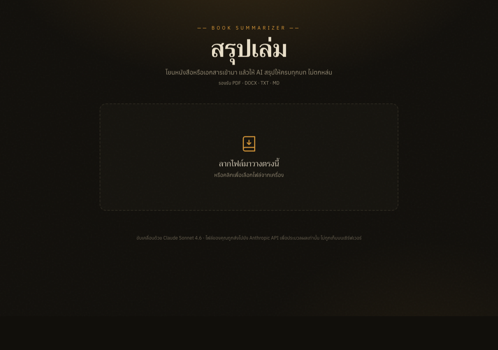

# สรุปเล่ม（サルップレム）— Thai document summarizer

สรุปเล่ม ("Summarize the Book") turns large documents into complete, structured Thai
summaries. Drop in a PDF, DOCX, TXT, or Markdown file — including scanned/image-only PDFs
— and the app counts the exact tokens, shows the estimated price in Thai Baht, and waits
for you to confirm before spending anything. Once you confirm, a chapter-by-chapter summary
streams onto the page in real time. Afterwards, a Q&A chat lets you ask follow-up questions
about the document; each question after the first costs roughly 90% less because the
document is held in a server-side prompt cache. Finished summaries are saved to
`localStorage` in your browser — free to reopen, works offline — and can be exported as
Markdown files. Documents are processed in memory per request and never stored on the
server.

---

## Screenshots

| Home — upload · cost preview · streaming summary |
| --- |
|  |

---

## What it is

สรุปเล่ม is a single-machine Next.js web app. The browser never talks to the Anthropic API
directly; the three route handlers (`/api/analyze`, `/api/summarize`, `/api/chat`) are the
only place `ANTHROPIC_API_KEY` exists, and the key never leaves the server.

- **Stack** — Next.js 16 · React 19 · TypeScript · Tailwind 4 · @anthropic-ai/sdk · unpdf · mammoth · react-markdown

| Topic | Decision |
| --- | --- |
| Privacy | Documents are processed in memory per request; nothing is stored server-side. |
| History | `localStorage` only (`saruplem-history`, max 30 entries) — stays in your browser, works offline. |
| Cost transparency | `/api/analyze` calls `count_tokens` (free) so you see the exact price before any paid call. |
| Prompt caching | The document sits in the first user turn with a `cache_control` marker; follow-up questions reuse the cached prefix at ~10% of the normal input price. |
| Stateless server | The file is re-sent each request — no server upload store, no database. |
| Rate limiting | `src/proxy.ts` (Next.js 16 renamed `middleware` → `proxy`) caps each IP at 10 requests/minute across the three paid routes, in-process. |

---

## Security — deploy this carefully

`/api/analyze`, `/api/summarize`, and `/api/chat` call the Anthropic API and spend real
credits on every request. The built-in rate limiter in `src/proxy.ts` is a single-instance
in-memory guard — it does **not** cover multi-instance or serverless deployments (e.g.
Vercel), where each instance keeps its own counter.

The limiter keys on the client IP. By default it does **not** read `x-forwarded-for`
(a client can forge that header to rotate its apparent IP and slip past the per-IP cap).
Set `TRUSTED_PROXY=1` **only** when the app runs behind a reverse proxy you control that
overwrites `x-forwarded-for` itself — then the limiter trusts the forwarded IP. Without a
trusted proxy and without a runtime-provided connection IP, all traffic shares a single
bucket (a global cap), which protects spend but rate-limits users together.

Before any public deployment you must add at least one of:

- A distributed rate limiter (e.g. Upstash `@upstash/ratelimit`) keyed by IP, **or**
- An auth gate / shared-secret header in front of the routes.

Every paid route (`/api/analyze`, `/api/summarize`, `/api/chat`) also counts tokens with
the free `count_tokens` endpoint and rejects any input over the model's context limit
**before** making a paid call, so a request that skips the price-preview step still can't
trigger an oversized spend.

Additionally: uploads are capped server-side at 25 MB (`MAX_UPLOAD_BYTES`). A
reverse-proxy body-size limit is also advisable.

---

## Installation

**Requirements** — [Node 22](https://nodejs.org) · npm · an [Anthropic API key](https://platform.claude.com)

**Mac / Linux**
```bash
git clone https://github.com/Tasachii/Sarup-Lem.git
cd Sarup-Lem
cp .env.example .env.local   # then open .env.local and paste your key
npm install
```

**Windows**
```bat
git clone https://github.com/Tasachii/Sarup-Lem.git
cd Sarup-Lem
copy .env.example .env.local  :: then open .env.local and paste your key
npm install
```

Open `.env.local` in any text editor and set:

```
ANTHROPIC_API_KEY=sk-ant-your-key-here
```

The key is server-only — it is never sent to the browser.

---

## Running

```bash
npm run dev          # Next.js dev server with hot reload on :3000
npm run build        # type-check + production build
npm run start        # serve the production build on :3000
npm test             # Vitest unit + route + component tests (145 tests, no API key needed)
npm run test:watch   # watch mode
npm run test:cov     # coverage report (lines 80 / funcs 85 / branches 75 gate)
npm run test:extract # offline extraction smoke-script (7 file-type cases)
```

---

## Usage

1. **Upload (1 action).** Drag a `.pdf`, `.docx`, `.txt`, or `.md` file onto the drop zone, or click to browse. Scanned/image-only PDFs are supported.
2. **Review the cost.** The app counts tokens and shows the estimated price in THB and USD. Nothing is charged yet.
3. **Pick a detail level.** Choose *Brief* (overview + key bullets, cheapest), *Standard* (full chapter-by-chapter), or *Detailed* (deep dive with examples and quotes). The price estimate updates instantly as you switch.
4. **Summarize.** Press **เริ่มสรุป** and watch the summary stream onto the paper card in real time. Press **⏹ หยุด** at any time to abort — spending stops, the partial summary stays visible but is not saved.
5. **Ask follow-up questions.** Type into the chat box below the finished summary — e.g. "ขยายความบทที่ 3". The first question pays full price; later questions within 5 minutes are ~90% cheaper.
6. **Save or revisit.** Press **คัดลอก** to copy, or download as `.md`. Past summaries appear on the home screen under the drop zone — tap any entry to reopen it for free.
7. **Start over.** Press **สรุปเล่มใหม่** to return to the upload screen.

---

## Architecture

```
Browser (page.tsx)
  │  FormData: file                       ┌──────────────────────────┐
  ├──────────► /api/analyze ─────────────►│                          │
  │  FormData: file + level               │   Anthropic API          │
  ├──────────► /api/summarize ───────────►│   Claude Sonnet 4.6      │
  │  FormData: file + history + question  │   (count_tokens /        │
  ├──────────► /api/chat ────────────────►│    messages.stream)      │
  │                                       └──────────────────────────┘
  └── localStorage: saruplem-history (client-only, max 30 entries)
```

```
src/
├── proxy.ts                  # per-IP rate limiter (Next.js 16 proxy)
├── lib/
│   ├── extract.ts            # extractFromFile() — PDF / DOCX / TXT / MD → text or base64
│   ├── summarize.ts          # model id, pricing, detail levels, prompts, estimateCost()
│   └── errors.ts             # friendlyError() — API errors → Thai messages
└── app/
    ├── page.tsx              # entire client UI — state machine: idle → analyzing → ready → summarizing → done
    └── api/
        ├── analyze/route.ts  # token count + validation (the price-tag step)
        ├── summarize/route.ts# streaming summary
        └── chat/route.ts     # streaming Q&A with prompt caching
```

---

## Configuration

| Variable | Default | Description |
| --- | --- | --- |
| `ANTHROPIC_API_KEY` | — | Required. Server-side only. Set in `.env.local`. |
| `TRUSTED_PROXY` | unset | Set to `1` only when running behind a trusted reverse proxy that sets `x-forwarded-for`. Enables per-IP rate limiting from the forwarded IP. Leave unset otherwise (the header is client-forgeable). |
| `USD_TO_THB` | `36` | FX rate used for the THB price estimate. Override when the rate drifts. |

---

## License

MIT © Phasathat Jaruchitsophon
